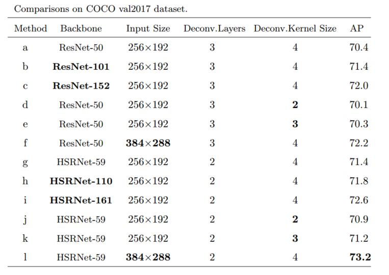
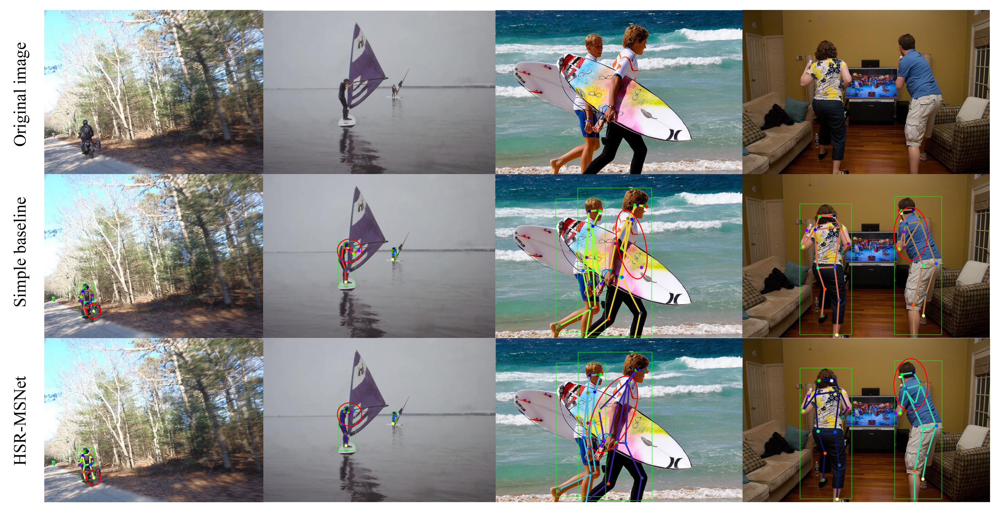

# Deep High Spatial Resolution and Multi-scale Features for Multi-Person Pose Estimation

This code is based on [Simple Baselines for Human Pose Estimation and Tracking](https://github.com/microsoft/human-pose-estimation.pytorch). Thanks to the authors. 
## Main Results
### Results on COCO val2017 with detector having human AP of 56.4 on COCO val2017 dataset
<div align="center">
    
</div>

### Note:
- Flip test is used
- Person detector has person AP of 56.4 on COCO val2017 dataset 

### Qualitative comparisons on COCO test2017 dataset.
<div align="center">
    
</div>

### Note:
- Person detector has person AP of 60.9 on COCO val2017 dataset 

## Environment
The code is developed using python 3.6 on Ubuntu 16.04. NVIDIA GPUs ared needed. The code is developed and tested using 1 NVIDIA P100 GPUS cards. Other platform or GPU card are not fully tested.

## Quick start
### Installation
1. Install pytorch >= v0.4.0 following [official instruction](https://pytorch.org/)
2. Disable cudnn for batch_norm
   ```
   # PYTORCH=/path/to/pytorch
   # for pytorch v0.4.0
   sed -i "1194s/torch\.backends\.cudnn\.enabled/False/g" ${PYTORCH}/torch/nn/functional.py
   # for pytorch v0.4.1
   sed -i "1254s/torch\.backends\.cudnn\.enabled/False/g" ${PYTORCH}/torch/nn/functional.py
   ```
   Note that instructions like # PYTORCH=/path/to/pytorch indicate that you should pick a path where you'd like to have pytorch installed  and then set an environment variable (PYTORCH in this case) accordingly.
1. Clone this repo, and we'll call the directory that you cloned as ${POSE_ROOT}
2. Install dependencies.
   ```
   pip install -r requirements.txt
   ```
3. Make libs
   ```
   cd ${POSE_ROOT}/lib
   make
   ```
3. Install [COCOAPI](https://github.com/cocodataset/cocoapi):
   ```
   # COCOAPI=/path/to/clone/cocoapi
   git clone https://github.com/cocodataset/cocoapi.git $COCOAPI
   cd $COCOAPI/PythonAPI
   # Install into global site-packages
   make install
   # Alternatively, if you do not have permissions or prefer
   # not to install the COCO API into global site-packages
   python3 setup.py install --user
   ```
   Note that instructions like # COCOAPI=/path/to/install/cocoapi indicate that you should pick a path where you'd like to have the software cloned and then set an environment variable (COCOAPI in this case) accordingly.
3. Download pytorch imagenet pretrained models from [pytorch model zoo](https://pytorch.org/docs/stable/model_zoo.html#module-torch.utils.model_zoo). 
4. Download mpii and coco pretrained model from [OneDrive](https://1drv.ms/f/s!AhIXJn_J-blW0D5ZE4ArK9wk_fvw) or [GoogleDrive](https://drive.google.com/drive/folders/13_wJ6nC7my1KKouMkQMqyr9r1ZnLnukP?usp=sharing). Please download them under ${POSE_ROOT}/models/pytorch, and make them look like this:

   ```
   ${POSE_ROOT}
    `-- models
        `-- pytorch
            |-- imagenet
            |   |-- resnet50-19c8e357.pth
            |   |-- resnet101-5d3b4d8f.pth
            |   `-- resnet152-b121ed2d.pth
            `-- pose_coco
                |-- pose_hsrnet_59_256x192.pth.tar
                |-- pose_hsrnet_59_384x288.pth.tar
                |-- pose_hsrnet_110_256x192.pth.tar
                |-- pose_hsrnet_161_256x192.pth.tar
                |-- pose_hsr_msnet_59_256x192.pth.tar
                |-- pose_hsr_msnet_59_384x288.pth.tar
                |-- pose_hsr_msnet_110_256x192.pth.tar
                `-- pose_hsr_msnet_161_256x192.pth.tar

   ```

4. Init output(training model output directory) and log(tensorboard log directory) directory.

   ```
   mkdir output 
   mkdir log
   ```

   and your directory tree should like this

   ```
   ${POSE_ROOT}
   ├── data
   ├── experiments
   ├── lib
   ├── log
   ├── models
   ├── output
   ├── pose_estimation
   ├── README.md
   └── requirements.txt
   ```
   
### Data preparation

**For COCO data**, please download from [COCO download](http://cocodataset.org/#download), 2017 Train/Val is needed for COCO keypoints training and validation. Person detection results of COCO val2017 for reproduce our multi-person pose estimation results are provided. Please download from [OneDrive](https://1drv.ms/f/s!AhIXJn_J-blWzzDXoz5BeFl8sWM-) or [GoogleDrive](https://drive.google.com/drive/folders/1fRUDNUDxe9fjqcRZ2bnF_TKMlO0nB_dk?usp=sharing).
Download and extract them under {POSE_ROOT}/data, and make them look like this:
```
${POSE_ROOT}
|-- data
`-- |-- coco
    `-- |-- annotations
        |   |-- person_keypoints_train2017.json
        |   `-- person_keypoints_val2017.json
        |-- person_detection_results
        |   |-- COCO_val2017_detections_AP_H_56_person.json
        `-- images
            |-- train2017
            |   |-- 000000000009.jpg
            |   |-- 000000000025.jpg
            |   |-- 000000000030.jpg
            |   |-- ... 
            `-- val2017
                |-- 000000000139.jpg
                |-- 000000000285.jpg
                |-- 000000000632.jpg
                |-- ... 
```

### Valid on COCO val2017 using pretrained models

```
python pose_estimation/valid.py \
    --cfg experiments/coco/hsrnet59/256x192_d256x3_adam_lr1e-3.yaml \
    --flip-test \
    --model-file models/pytorch/pose_coco/pose_hsrnet_59_256x192.pth.tar
```

```
python pose_estimation/valid.py \
    --cfg experiments/coco/hsr-msnet59/256x192_d256x3_adam_lr1e-3.yaml \
    --flip-test \
    --model-file models/pytorch/pose_coco/pose_hsr_msnet_59_256x192.pth.tar
```

### Training on COCO train2017

```
python pose_estimation/train.py \
    --cfg experiments/coco/hsrnet59/256x192_d256x3_adam_lr1e-3.yaml
```

```
python pose_estimation/train.py \
    --cfg experiments/coco/hsr-msnet59/256x192_d256x3_adam_lr1e-3.yaml
```

